# TCMI-Vue 项目

## 项目概述
这是一个基于 Vue.js 和 Vite 构建的项目，用于实现 TCMI 系统的前端功能。

## 运行方式
1. 安装依赖：`npm install`
2. 启动开发服务器：`npm run dev`
3. 构建生产版本：`npm run build`

## 依赖项
- Vue.js
- Vite
- 其他依赖请参考 `package.json` 文件

## 项目结构
- `public/`: 静态资源目录
- `src/`: 源代码目录
  - `main.js`: 项目入口文件
  - `App.vue`: 根组件

## 注意事项
- 确保 Node.js 版本 >= 14.0.0
- 开发时建议使用 Chrome 浏览器

## 界面展示

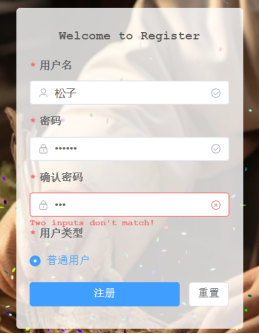

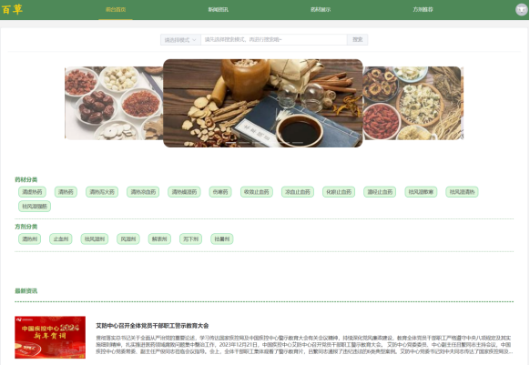

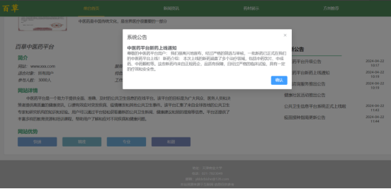

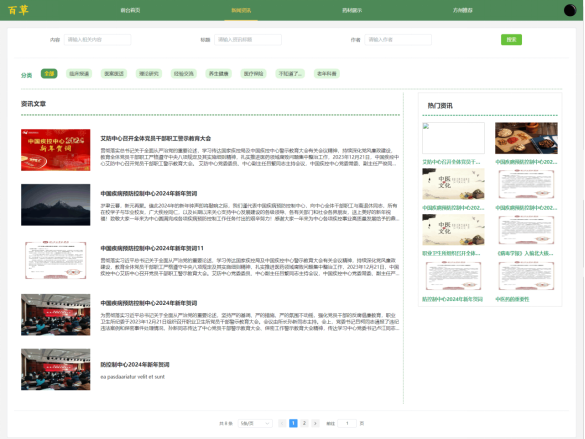

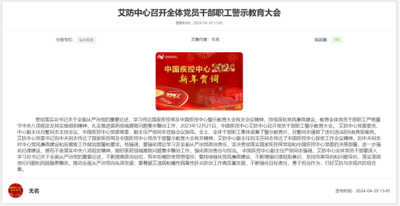

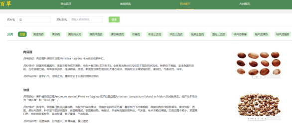

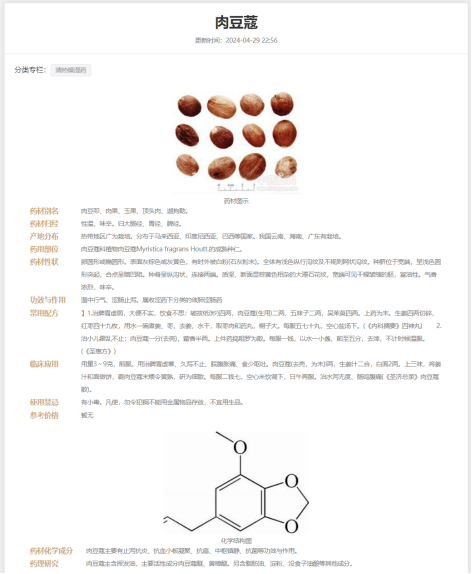

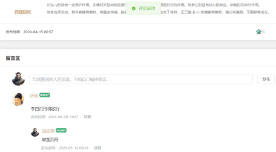

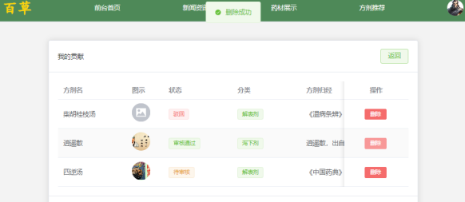

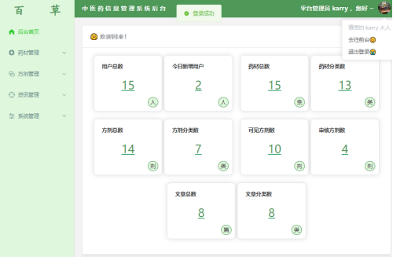

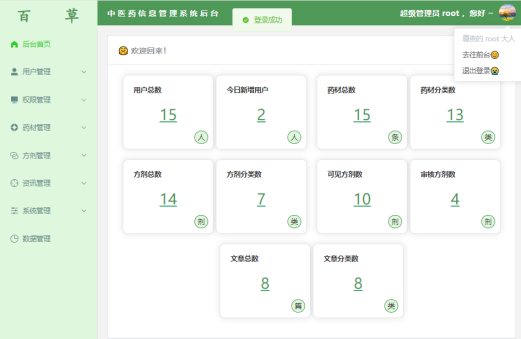

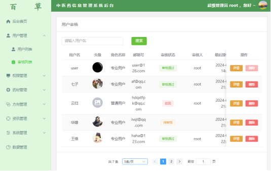

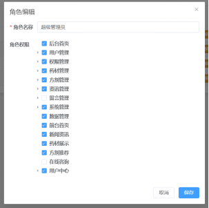

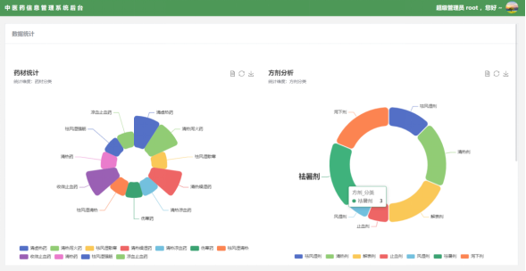

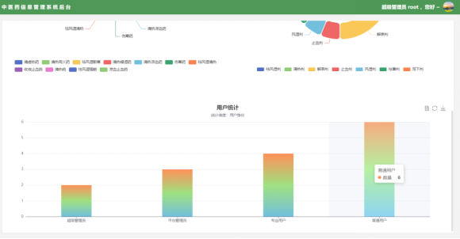

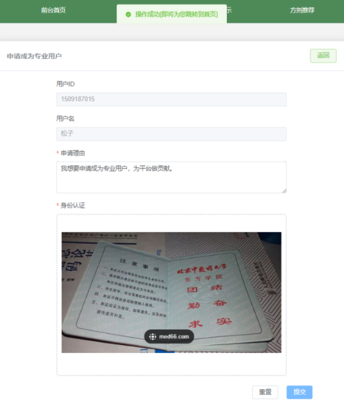