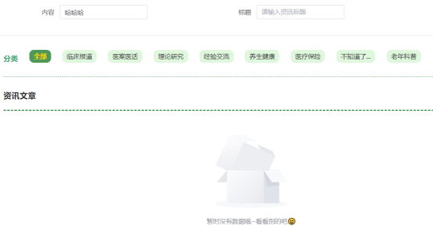

# TCMI-Vue 项目

## 项目概述
这是一个基于 Vue.js 和 Vite 构建的项目，用于实现中医药信息管理系统系统的前端功能。
中医药信息管理系统致力于构建一个基于现代流行框架开发的平台，平台核心主要对中药材信息进行管理，对中医药进行零门槛的科普，实现对中药材的管理。
通过系统可以快速、精准、多方式的查询到中药材相关信息；进行异步留言完成用户间的交互以获取额外信息；管理个人关注的中药材相关信息；能够在后台对中医药信息进行管理与数据统计。

## 运行方式
1. 安装依赖：`npm install`
2. 启动开发服务器：`npm run dev`
3. 构建生产版本：`npm run build`

## 依赖项
- Vue.js
- Vite
- 其他依赖请参考 `package.json` 文件

## 项目结构
- `public/`: 静态资源目录
- `src/`: 源代码目录
  - `main.js`: 项目入口文件
  - `App.vue`: 根组件

## 注意事项
- 确保 Node.js 版本 >= 14.0.0
- 开发时建议使用 Chrome 浏览器

## 界面展示

